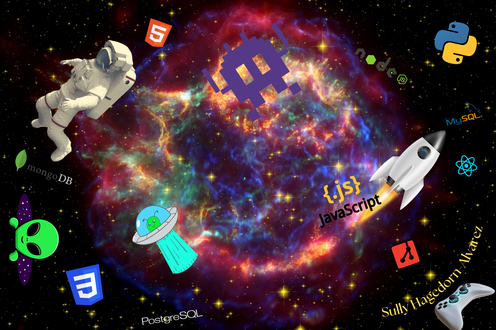

<h1 align="center">Hey! I'm Sully Hagedorn-Alvarez</h1>
<h3 align="center">"Great minds think alike"</h3>

  

  

- 🔭 I’m currently working on [Learning Python with Dra. Yu!](<[https://trello.com/b/UMA0CtQ4/cookbook](https://100daysofpython.dev/)>)

- 🌱 I’m currently learning **Tailwind,Bootstraps**

- 👨‍💻 All of my projects are available at [https://github.com/lucy444sarah](https://github.com/lucy444sarah)

- 📝 I regularly write articles on [https://trouverlamode.com](https://trouverlamode.com)

- 💬 Ask me about **HTML,CSS,JS**

- 📫 How to reach me **hagedornalvarezsully@gmail.com**

- 📄 Know about my experiences [https://www.linkedin.com/in/sully-hagedorn-alvarez-9a5640250/](https://www.linkedin.com/in/sully-hagedorn-alvarez-9a5640250/)

- ⚡ Fun fact **I love Schnitzels a lot!!!**

<h3 align="left">Connect with me:</h3>

<h3 align="left">Languages and Tools:</h3>

            

&nbsp;

